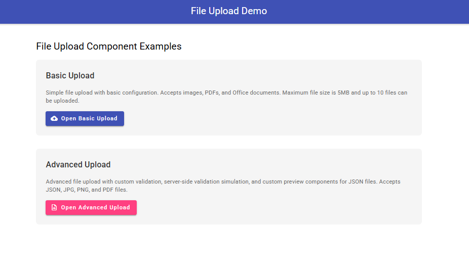
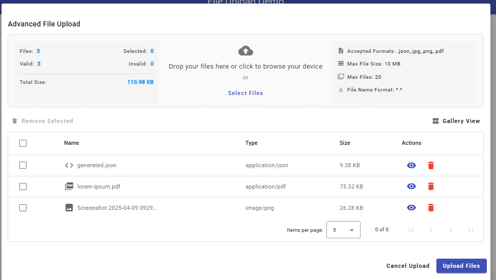
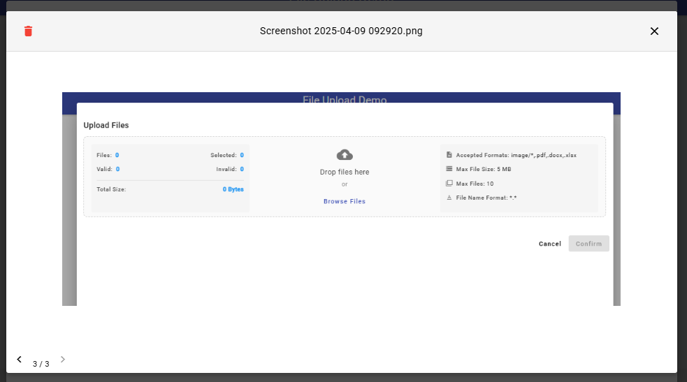
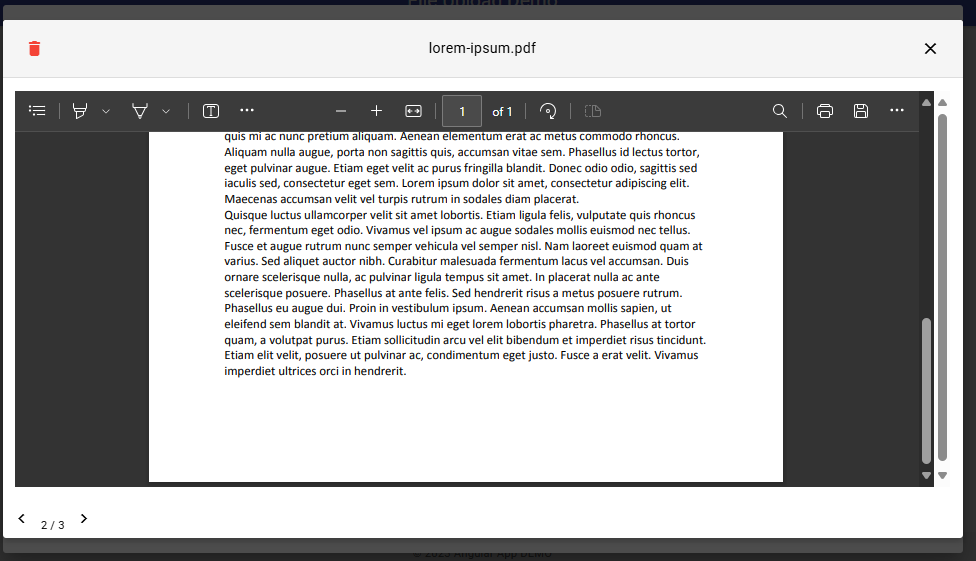
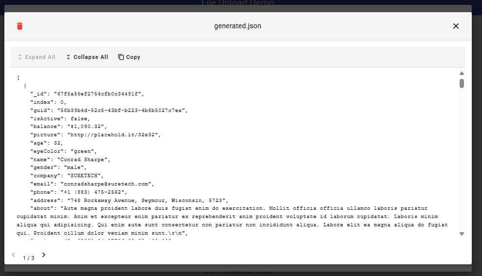
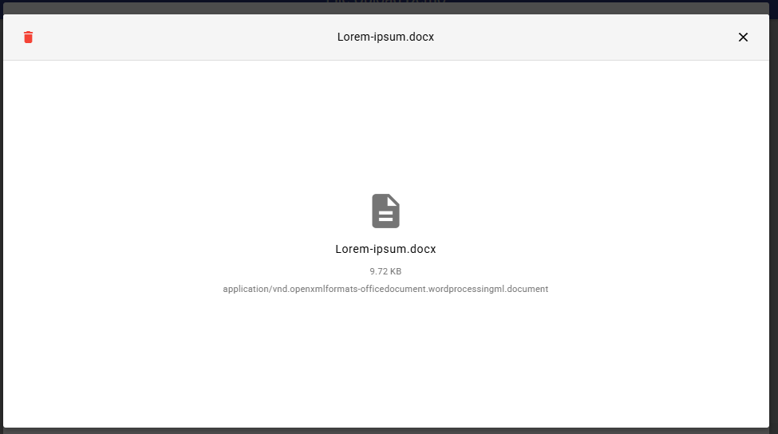

# Angular Upload Modal Component

This project contains a file upload component for Angular, offering a modern and flexible interface for selecting, previewing, and uploading files.

## Features

- Drag and drop file support
- Grid or table view display
- Preview for different file types (images, PDFs, JSON, etc.)
- File validation (type, size, quantity)
- Pagination for navigating between files
- Support for upload with progress bar
- Standalone component compatible with Angular 15+
- Responsive design with Angular Material

## Demo (Screenshot)













## Installation

This component is part of the project and does not require separate installation. To use it in your own project, copy the relevant files and install the necessary dependencies.

### Dependencies

The component requires the following dependencies:

```bash
npm install @angular/material @angular/cdk
```

## Usage

### Import

The component is standalone, so you can import it directly:

```typescript
import { UploadModalComponent } from './path/to/upload-modal.component';
```

### Basic Configuration

```typescript
import { Component } from '@angular/core';
import { MatDialog } from '@angular/material/dialog';
import { UploadModalComponent } from './path/to/upload-modal.component';
import { FileItem, UploadModalConfig } from './path/to/upload-modal.models';

@Component({
  selector: 'app-example',
  template: `
    <button mat-raised-button color="primary" (click)="openUploadModal()">
      Upload Files
    </button>
  `,
  standalone: true,
  imports: [MatButtonModule]
})
export class ExampleComponent {
  constructor(private dialog: MatDialog) {}

  openUploadModal(): void {
    const dialogRef = this.dialog.open(UploadModalComponent, {
      width: '90%',
      maxWidth: '1200px',
      height: '90%',
      data: {
        title: 'Upload Files',
        acceptedFormats: 'image/*,.pdf,.doc,.docx',
        maxFileSize: 10 * 1024 * 1024, // 10MB
        maxFiles: 5,
        allowOnlyValidFiles: true
      } as UploadModalConfig
    });

    dialogRef.afterClosed().subscribe((result: FileItem[] | undefined) => {
      if (result) {
        console.log('Selected files:', result);
      }
    });
  }
}
```

### Advanced Configuration with Custom Preview

```typescript
import { Component } from '@angular/core';
import { MatDialog } from '@angular/material/dialog';
import { UploadModalComponent } from './path/to/upload-modal.component';
import { FileItem, UploadModalConfig } from './path/to/upload-modal.models';
import { JsonPreviewComponent } from './path/to/json-preview.component';

@Component({
  selector: 'app-advanced-example',
  template: `
    <button mat-raised-button color="primary" (click)="openAdvancedUploadModal()">
      Advanced Upload
    </button>
  `,
  standalone: true,
  imports: [MatButtonModule]
})
export class AdvancedExampleComponent {
  constructor(private dialog: MatDialog) {}

  openAdvancedUploadModal(): void {
    const dialogRef = this.dialog.open(UploadModalComponent, {
      width: '90%',
      maxWidth: '1200px',
      height: '90%',
      data: {
        title: 'Advanced Upload',
        acceptedFormats: '*',
        maxFileSize: 50 * 1024 * 1024, // 50MB
        maxFiles: 10,
        allowOnlyValidFiles: true,
        previewComponents: {
          'application/json': JsonPreviewComponent
        },
        validateFile: (file: FileItem): Promise<{ isValid: boolean, reason?: string }> => {
          return new Promise((resolve) => {
            // Custom validation example
            if (file.name.includes('confidential')) {
              resolve({ isValid: false, reason: 'Confidential files are not allowed' });
            } else {
              resolve({ isValid: true });
            }
          });
        },
        uploadFiles: (files: FileItem[]): Promise<FileItem[]> => {
          // Upload simulation with progress
          return new Promise((resolve) => {
            let completedFiles = 0;
            
            files.forEach((file) => {
              let progress = 0;
              
              const interval = setInterval(() => {
                progress += Math.random() * 10;
                
                if (progress >= 100) {
                  progress = 100;
                  clearInterval(interval);
                  
                  file.status = 'success';
                  file.progress = 100;
                  
                  completedFiles++;
                  if (completedFiles === files.length) {
                    resolve(files);
                  }
                } else {
                  file.status = 'uploading';
                  file.progress = Math.round(progress);
                }
              }, 200 + Math.random() * 300);
            });
          });
        }
      } as UploadModalConfig
    });

    dialogRef.afterClosed().subscribe((result: FileItem[] | undefined) => {
      if (result) {
        console.log('Uploaded files:', result);
      }
    });
  }
}
```

## API

### UploadModalConfig

| Property | Type | Description |
|-------------|------|-----------|
| `title` | `string` | Title of the upload modal |
| `acceptedFormats` | `string` | Accepted file formats (e.g., 'image/*,.pdf') |
| `maxFileSize` | `number` | Maximum file size in bytes |
| `maxFiles` | `number` | Maximum number of files allowed |
| `allowOnlyValidFiles` | `boolean` | Whether only valid files are allowed for upload |
| `previewComponents` | `Record<string, Type<any>>` | Custom components for previewing specific file types |
| `validateFile` | `(file: FileItem) => Promise<ValidationResult>` | Custom function for file validation |
| `uploadFiles` | `(files: FileItem[]) => Promise<FileItem[]>` | Function to process file uploads |

### FileItem

| Property | Type | Description |
|-------------|------|-----------|
| `id` | `string` | Unique identifier for the file |
| `file` | `File` | Original File object |
| `name` | `string` | File name |
| `size` | `number` | File size in bytes |
| `type` | `string` | File MIME type |
| `preview` | `string` | Preview URL for the file (if available) |
| `isValid` | `boolean` | Whether the file is valid |
| `validationReason` | `string` | Reason for invalidation (if applicable) |
| `status` | `'pending' \| 'uploading' \| 'success' \| 'error'` | Upload status |
| `progress` | `number` | Upload progress (0-100) |
| `errorMessage` | `string` | Error message (if status is 'error') |

## Creating Custom Preview Components

You can create custom components to preview specific file types. For example, the JsonPreviewComponent for JSON files:

```typescript
import { Component, OnInit, Inject } from '@angular/core';
import { CommonModule } from '@angular/common';
import { MatButtonModule } from '@angular/material/button';
import { MatIconModule } from '@angular/material/icon';
import { MatTooltipModule } from '@angular/material/tooltip';
import { FileItem } from '../../shared/models/upload-modal.models';

@Component({
  selector: 'app-json-preview',
  template: `
    <div class="json-preview-container">
      <div class="json-toolbar">
        <button mat-button (click)="copyToClipboard()" matTooltip="Copy to clipboard">
          <mat-icon>content_copy</mat-icon> Copy
        </button>
        <button mat-button (click)="toggleTheme()" matTooltip="Toggle theme">
          <mat-icon>{{ isDarkTheme ? 'light_mode' : 'dark_mode' }}</mat-icon> 
          {{ isDarkTheme ? 'Light' : 'Dark' }} Theme
        </button>
      </div>
      <div class="json-content" [class.dark-theme]="isDarkTheme">
        <pre>{{ formattedJson }}</pre>
      </div>
    </div>
  `,
  styleUrls: ['./json-preview.component.scss'],
  standalone: true,
  imports: [
    CommonModule, 
    MatButtonModule, 
    MatIconModule,
    MatTooltipModule
  ]
})
export class JsonPreviewComponent implements OnInit {
  @Input() file!: File;
  jsonData: any;
  formattedJson: string = '';
  isDarkTheme: boolean = false;

  constructor(@Inject('fileItem') private fileItem: FileItem) {
    this.file = fileItem.file;
  }

  ngOnInit(): void {
    this.loadJsonContent();
  }

  loadJsonContent(): void {
    if (!this.file) {
      console.error('No file provided for JSON preview');
      this.formattedJson = 'Error: No file provided';
      return;
    }
    
    const reader = new FileReader();
    reader.onload = (e: ProgressEvent<FileReader>) => {
      try {
        const content = e.target?.result as string;
        this.jsonData = JSON.parse(content);
        this.formattedJson = JSON.stringify(this.jsonData, null, 2);
      } catch (error) {
        console.error('Error parsing JSON:', error);
        this.formattedJson = 'Error parsing JSON: ' + (error instanceof Error ? error.message : String(error));
      }
    };
    
    reader.onerror = (error) => {
      console.error('Error reading file:', error);
      this.formattedJson = 'Error reading file';
    };
    
    reader.readAsText(this.file);
  }

  copyToClipboard(): void {
    navigator.clipboard.writeText(this.formattedJson)
      .then(() => console.log('JSON copied to clipboard'))
      .catch(err => console.error('Could not copy JSON: ', err));
  }

  toggleTheme(): void {
    this.isDarkTheme = !this.isDarkTheme;
  }
}
```

## File Structure

```
src/
├── app/
│   ├── shared/
│   │   ├── components/
│   │   │   ├── upload-modal/
│   │   │   │   ├── upload-modal.component.ts
│   │   │   │   ├── upload-modal.component.html
│   │   │   │   ├── upload-modal.component.scss
│   │   │   │   └── upload-modal.module.ts
│   │   │   ├── confirm-dialog/
│   │   │   │   ├── confirm-dialog.component.ts
│   │   │   │   ├── confirm-dialog.component.html
│   │   │   │   └── confirm-dialog.component.scss
│   │   │   └── preview-components/
│   │   │       ├── json-preview/
│   │   │       │   ├── json-preview.component.ts
│   │   │       │   └── json-preview.component.scss
│   │   │       ├── csv-preview/
│   │   │       │   ├── csv-preview.component.ts
│   │   │       │   └── csv-preview.component.scss
│   │   │       └── index.ts
│   │   ├── models/
│   │   │   └── upload-modal.models.ts
│   │   └── services/
│   │       └── file-utils.service.ts
│   ├── examples/
│   │   └── upload-example/
│   │       ├── upload-example.component.ts
│   │       └── upload-example.module.ts
│   ├── app.component.ts
│   └── ...
├── assets/
│   ├── images/
│   │   └── upload-placeholder.svg
│   └── ...
└── ...
```

## Considerations

- The component uses Angular Material for the interface, so make sure you have Material installed and configured in your project.
- For drag and drop support, the component uses the browser's native APIs.
- For PDF preview, the browser must support displaying PDFs in iframes.
- For custom preview components, they must be standalone and accept an injected FileItem.

## License

This project is licensed under the MIT License - see the LICENSE file for details.


